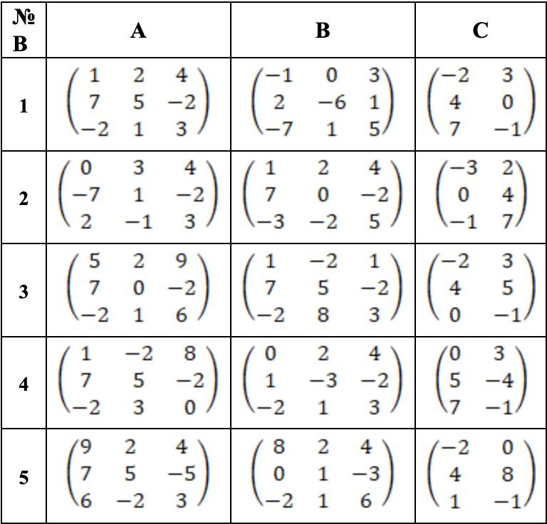

#### Даны матрицы *A*, *B* и *C*. Найти:
- *A + B*
- *B - A*
- *A $\times$ C*
- *A $\times$ B $\times$ C*



1.1
```math
\begin{pmatrix}
    1 & 2 & 4 \\
    7 & 5 & -2 \\
    -2 & 1 & 3 
\end{pmatrix}
+
\begin{pmatrix}
    -1 & 0 & 3 \\
    2 & -6 & 1 \\
    -7 & 1 & -5 
\end{pmatrix}
=
\begin{pmatrix}
    0 & 2 & 7 \\
    9 & -1 & -1 \\
    -9 & 2 & 8 
\end{pmatrix}
```
1.2
$$
\begin{pmatrix}
        -1 & 0 & 3 \\
    2 & -6 & 1 \\
    -7 & 1 & -5 
\end{pmatrix}
-
\begin{pmatrix}
    1 & 2 & 4 \\
    7 & 5 & -2 \\
    -2 & 1 & 3 
\end{pmatrix}
=
\begin{pmatrix}
    2 & 2 & 1 \\
    5 & 11 & -3 \\
    -9 & 0 & -2 
\end{pmatrix}
$$
1.3
$$
\begin{pmatrix}
    1 & 2 & 4 \\
    7 & 5 & -2 \\
    -2 & 1 & 3 
\end{pmatrix}
\times
\begin{pmatrix}
    -2 & 3 \\
    4 & 0 \\
    7 & -1 
\end{pmatrix}
=
\begin{pmatrix}
    1·(-2)+2·4+4·7 & 1·3+2·0+4·(-1) \\
    7·(-2)+5·4+(-2)·7 & 7·3+5·0+(-2·(-1)) \\
    (-2)·(-2)+1·4+3·7 & (-2)·3+1·0+3·(-1)
\end{pmatrix}
=
\begin{pmatrix}
    34 & -1 \\
    -8 & 23 \\
    29 & -9
\end{pmatrix}
$$
1.4
$$
\begin{pmatrix}
    1 & 2 & 4 \\
    7 & 5 & -2 \\
    -2 & 1 & 3 
\end{pmatrix}
\times
\begin{pmatrix}
    -1 & 0 & 3 \\
    2 & -6 & 1 \\
    -7 & 1 & -5 
\end{pmatrix}
\times
\begin{pmatrix}
    -2 & 3 \\
    4 & 0 \\
    7 & -1 
\end{pmatrix}
$$
$$
\begin{pmatrix}
    1 & 2 & 4 \\
    7 & 5 & -2 \\
    -2 & 1 & 3 
\end{pmatrix}
\times
\begin{pmatrix}
    -1 & 0 & 3 \\
    2 & -6 & 1 \\
    -7 & 1 & -5 
\end{pmatrix}
=
$$
$$
=
\begin{pmatrix}
    1·(-1)+2·2+4·(-7) & 1·0+2·(-6)+4·1 & 1·3+2·1+4·(-5) \\
    7·(-1)+5·2+(-2)·(-7) & 7·0+5·(-6)+(-2)·1 & 7·3+5·1+(-2)·(-5) \\
    (-2)·(-1)+1·2+3·(-7) & (-2)·0+1·(-6)+3·1 & (-2)·3+1·1+3·(-5)
\end{pmatrix}
=
\begin{pmatrix}
    -25 & -8 & -15 \\
    17 & -32 & 36 \\
    -17 & -3 & -20
\end{pmatrix}
$$
$$
\begin{pmatrix}
    -25 & -8 & -15 \\
    17 & -32 & 36 \\
    -17 & -3 & -20
\end{pmatrix}
\times
\begin{pmatrix}
    -2 & 3 \\
    4 & 0 \\
    7 & -1 
\end{pmatrix}
=
$$
$$
\begin{pmatrix}
    (-25)·(-2)+(-8)·4+(-15)·7 & (-25)·3+(-8)·0+(-15)·(-1) \\
    17·(-2)+(-32)·4+36·7 & 17·3+(-32)·0+36·(-1) \\
    (-17)·(-2)+(-3)·4+(-20)·7 & (-17)·3+(-3)·0+(-20)·(-1)
\end{pmatrix}
=
\begin{pmatrix}
    -87 & -60 \\
    90 & 15 \\
    -118 & -31
\end{pmatrix}
$$
2.1
$$
\begin{pmatrix}
    0 & 3 & 4 \\
    -7 & 1 & -2 \\
    2 & -1 & 3
\end{pmatrix}
+
\begin{pmatrix}
    1 & 2 & 4 \\
    7 & 0 & -2 \\
    -3 & -2 & 5
\end{pmatrix}
=
\begin{pmatrix}
    1 & 5 & 8 \\
    0 & 1 & -4 \\
    -1 & -3 & 8
\end{pmatrix}
$$
2.2
$$
\begin{pmatrix}
    1 & 2 & 4 \\
    7 & 0 & -2 \\
    -3 & -2 & 5
\end{pmatrix}
-
\begin{pmatrix}
    0 & 3 & 4 \\
    -7 & 1 & -2 \\
    2 & -1 & 3
\end{pmatrix}
=
\begin{pmatrix}
    1 & -1 & 0 \\
    14 & -1 & 0 \\
    -5 & -1 & 2
\end{pmatrix}
$$
2.3
$$
\begin{pmatrix}
    0 & 3 & 4 \\
    -7 & 1 & -2 \\
    2 & -1 & 3
\end{pmatrix}
\times
\begin{pmatrix}
    -3 & 2 \\
    0 & 4 \\
    -1 & 7
\end{pmatrix}
=
\begin{pmatrix}
    0·(-3)+3·0+4·(-1) & 0·2+3·4+4·7 \\
    (-7)·(-3)+1·0+(-2)·(-1) & (-7)·2+1·4+(-2)·7 \\
    2·(-3)+(-1)·0+3·(-1) & 2·2+(-1)·4+3·7
\end{pmatrix}

=
\begin{pmatrix}
    -4 & 40 \\
    23 & -24 \\
    -9 & 21
\end{pmatrix}
$$
2.4
$$
\begin{pmatrix}
    0 & 3 & 4 \\
    -7 & 1 & -2 \\
    2 & -1 & 3
\end{pmatrix}
\times
\begin{pmatrix}
    1 & 2 & 4 \\
    7 & 0 & -2 \\
    -3 & -2 & 5
\end{pmatrix}
\times
\begin{pmatrix}
    -3 & 2 \\
    0 & 4 \\
    -1 & 7
\end{pmatrix}
$$
$$
\begin{pmatrix}
    0 & 3 & 4 \\
    -7 & 1 & -2 \\
    2 & -1 & 3
\end{pmatrix}
\times
\begin{pmatrix}
    1 & 2 & 4 \\
    7 & 0 & -2 \\
    -3 & -2 & 5
\end{pmatrix}
=
$$
$$
=
\begin{pmatrix}
    0·1+3·7+4·(-3) & 0·2+3·0+4·(-2) & 0·4+3·(-2)+4·5 \\
    (-7)·1+1·7+(-2)·(-3) & (-7)·2+1·0+(-2)·(-2) & (-7)·4+1·(-2)+(-2)·5 \\
    2·1+(-1)·7+3·(-3) & 2·2+(-1)·0+3·(-2) & 2·4+(-1)·(-2)+3·5
\end{pmatrix}
=
\begin{pmatrix}
    9 & -8 & 14 \\
    6 & -10 & -40 \\
    -14 & -2 & 25
\end{pmatrix}
$$
$$
\begin{pmatrix}
    9 & -8 & 14 \\
    6 & -10 & -40 \\
    -14 & -2 & 25
\end{pmatrix}
\times
\begin{pmatrix}
    -3 & 2 \\
    0 & 4 \\
    -1 & 7
\end{pmatrix}
=
\begin{pmatrix}
    9·(-3)+(-8)·0+14·(-1) & 9·2+(-8)·4+14·7 \\
    6·(-3)+(-10)·0+(-40)·(-1) & 6·2+(-10)·4+(-40)·7 \\
    (-14)·(-3)+(-2)·0+25·(-1) & (-14)·2+(-2)·4+25·7
\end{pmatrix}
=
$$
$$
=
\begin{pmatrix}
    -41 & 84 \\
    22 & -308 \\
    17 & 139
\end{pmatrix}
$$
3.1
$$
\begin{pmatrix}
    5 & 2 & 9 \\
    7 & 0 & -2 \\
    -2 & 1 & 6
\end{pmatrix}
+
\begin{pmatrix}
    1 & -2 & 1 \\
    7 & 5 & -2 \\
    -2 & 8 & 3
\end{pmatrix}
=
\begin{pmatrix}
    6 & 0 & 10 \\
    14 & 5 & -4 \\
    -4 & 9 & 9
\end{pmatrix}
$$
3.2
$$
\begin{pmatrix}
    1 & -2 & 1 \\
    7 & 5 & -2 \\
    -2 & 8 & 3
\end{pmatrix}
-
\begin{pmatrix}
    5 & 2 & 9 \\
    7 & 0 & -2 \\
    -2 & 1 & 6
\end{pmatrix}
=
\begin{pmatrix}
    -4 & -4 & -8 \\
    0 & 5 & 0 \\
    0 & 7 & -3
\end{pmatrix}
$$
3.3
$$
\begin{pmatrix}
    5 & 2 & 9 \\
    7 & 0 & -2 \\
    -2 & 1 & 6
\end{pmatrix}
\times
\begin{pmatrix}
    -2 & 3 \\
    4 & 5 \\
    0 & -1
\end{pmatrix}
=
\begin{pmatrix}
    5·(-2)+2·4+9·0 & 5·3+2·5+9·(-1) \\
    7·(-2)+0·4+(-2)·0 & 7·3+0·5+(-2)·(-1) \\
    (-2)·(-2)+1·4+6·0 & (-2)·3+1·5+6·(-1)
\end{pmatrix}
=
\begin{pmatrix}
    -2 & 16 \\
    -14 & 23 \\
    8 & -7
\end{pmatrix}
$$
3.4
$$
\begin{pmatrix}
    5 & 2 & 9 \\
    7 & 0 & -2 \\
    -2 & 1 & 6
\end{pmatrix}
\times
\begin{pmatrix}
    1 & -2 & 1 \\
    7 & 5 & -2 \\
    -2 & 8 & 3
\end{pmatrix}
\times
\begin{pmatrix}
    -2 & 3 \\
    4 & 5 \\
    0 & -1
\end{pmatrix}
$$
$$
\begin{pmatrix}
    5 & 2 & 9 \\
    7 & 0 & -2 \\
    -2 & 1 & 6
\end{pmatrix}
\times
\begin{pmatrix}
    1 & -2 & 1 \\
    7 & 5 & -2 \\
    -2 & 8 & 3
\end{pmatrix}
=
$$
$$
=
\begin{pmatrix}
    5·1+2·7+9·(-2) & 5·(-2)+2·5+9·8 & 5·1+2·(-2)+9·3 \\
    7·1+0·(7)+(-2)·(-2) & 7·(-2)+0·5+(-2)·8 & 7·1+0·(-2)+(-2)·3 \\
    (-2)·1+1·7+6·(-2) & (-2)·(-2)+1·5+6·8 & (-2)·1+1·(-2)+6·3
\end{pmatrix}
=
\begin{pmatrix}
    1 & 72 & 28 \\
    11 & -30 & 1 \\
    -7 & 57 & 14
\end{pmatrix}
$$
$$
\begin{pmatrix}
    1 & 72 & 28 \\
    11 & -30 & 1 \\
    -7 & 57 & 14
\end{pmatrix}
\times
\begin{pmatrix}
    -2 & 3 \\
    4 & 5 \\
    0 & -1
\end{pmatrix}
=
\begin{pmatrix}
    1·(-2)+72·4+28·0 & 1·3+72·5+28·(-1) \\
    11·(-2)+(-30)·4+1·0 & 11·(3)+(-30)·5+1·(-1) \\
    (-7)·(-2)+57·4+14·0 & (-7)·3+57·5+14·(-1)
\end{pmatrix}
=
\begin{pmatrix}
    286 & 335 \\
    -142 & -118 \\
    242 & 250
\end{pmatrix}
$$

#### *Операции с матрицами 4 и 5 приведены в файле operations_on_matrices.ipynb*

